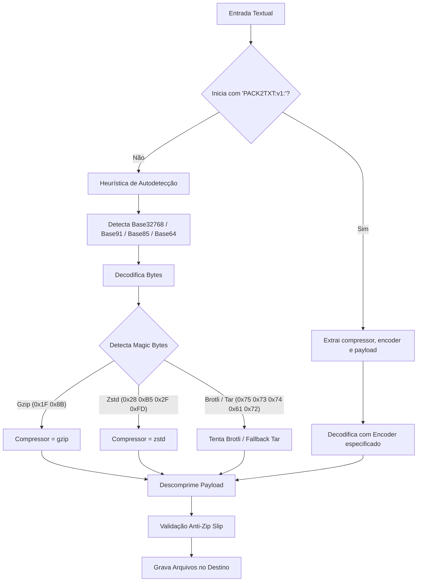

# OpenSpec: Especificação do Protocolo `pack2txt` (v1)

**Status:** Rascunho Formal / Fase 0  
**Versão:** 1.0.0  
**Autor:** Engenharia de Arquitetura `pack2txt`  
**Data:** Agosto de 2026  

---

## 1. Visão Geral e Objetivos

O protocolo **`pack2txt` (v1)** estabelece uma especificação aberta, determinística e de alta densidade para compactar estruturas completas de arquivos e diretórios em um envelope de texto puro UTF-8. 

O protocolo foi projetado especificamente para:
1. **Otimização Extrema de Contexto em IAs (LLMs):** Reduzir em até 60% a contagem de caracteres e tokens necessários para transferir bases de código para modelos como Gemini, Claude e GPT.
2. **Zero Dependência de Disco / Streaming em Memória:** Processar arquivos como um fluxo contínuo Solid TAR na memória RAM.
3. **Portabilidade Universal:** Permitir transferência direta via chat, terminal, clipboard (`pbcopy`/`xclip`), e-mail ou arquivos `.txt`.
4. **Segurança Rigorosa:** Garantir proteção total contra ataques de *Zip Slip* (path traversal) e integridade dos metadados de arquivos.

---

## 2. Gramática e Sintaxe do Envelope

Todo payload gerado pelo protocolo DEVE seguir a seguinte estrutura de envelope em formato de linha única ou bloco contínuo de texto:

### 2.1 Sintaxe ABNF
```abnf
envelope       = magic ":" version ":" compressor ":" encoder ":" payload
magic          = "PACK2TXT"
version        = "v1"
compressor     = "brotli" / "zstd" / "gzip" / "none"
encoder        = "b32768" / "b91" / "b85" / "b64"
payload        = 1*(safe-char)
```

### 2.2 Exemplo Canônico
```text
PACK2TXT:v1:brotli:b32768:一丁丂七丄丅丆万丈三上下不与...
```

### 2.3 Definição dos Campos
| Campo | Tipo | Descrição |
|---|---|---|
| `magic` | String (`PACK2TXT`) | Identificador mágico de 8 bytes para validação instantânea. |
| `version` | String (`v1`) | Identificador de versão do contrato de serialização. |
| `compressor` | Enum | Identifica o algoritmo aplicado no fluxo TAR (`brotli`, `zstd`, `gzip`, `none`). |
| `encoder` | Enum | Identifica a codificação binário-para-texto utilizada (`b32768`, `b91`, `b85`, `b64`). |
| `payload` | String | Sequência de caracteres resultante da codificação do binário comprimido. |

---

## 3. Arquitetura do Fluxo de Dados (Pipeline)

```
[Arquivos em Disco / Pastas]
            │
            ▼ (1. Filtro & Normalização de Caminhos)
   [Lista de Arquivos Filtrados]
            │
            ▼ (2. Serialização Solid TAR na Memória)
      [Raw TAR Bytes]
            │
            ▼ (3. Compressão Máxima: Brotli Q11 / Zstd / Gzip / Auto)
   [Compressed Binary Bytes]
            │
            ▼ (4. Codificação Textual: Base32768 / Base91 / Base85 / Base64)
    [Encoded Text String]
            │
            ▼ (5. Montagem do Envelope PACK2TXT:v1:...)
 [Output Text / Clipboard / File]
```

---

## 4. Especificação dos Componentes

### 4.1 Estrutura de Arquivamento (Solid TAR)
* O formato de empacotamento base é o padrão **POSIX USTAR / PAX TAR**.
* **Solid Streaming:** Todos os arquivos são serializados em um único fluxo contínuo na memória RAM (`bytes.Buffer`), garantindo que o algoritmo de compressão aproveite similaridades entre múltiplos arquivos (deduplicação inter-arquivo).
* **Normalização de Caminhos:**
  * Separador canônico: barra normal (`/`), independentemente do SO de origem (Windows/Linux/macOS).
  * Caminhos devem ser relativos à raiz do pacote (ex: `src/main.go`, nunca `/src/main.go` nem `.\src\main.go`).
  * Metadados preservados: permissões Unix (`0755` para executáveis/pastas, `0644` para arquivos regulares), tamanho, tipo de entrada e timestamps de modificação.

### 4.2 Algoritmos de Compressão

| Algoritmo | Identificador | Nível / Parâmetros | Caso de Uso Principal |
|---|---|---|---|
| **Brotli** | `brotli` | Quality 11, LGWin 22 (4 MB) | **Padrão:** Maior taxa de compressão em código-fonte e textos repetitivos. |
| **Zstandard** | `zstd` | `SpeedBestCompression` (Level 19-22) | Alta taxa de compressão com descompressão ultra-rápida. |
| **Gzip** | `gzip` | `gzip.BestCompression` (Level 9) | Compatibilidade ampla com ferramentas legadas. |
| **None** | `none` | 0 (Pass-through) | Transferência de arquivos pré-comprimidos (imagens, zips). |
| **Auto Optimizer** | `auto` | Executa `brotli`, `zstd` e `gzip` em memória | Avalia o menor tamanho em bytes e grava o identificador vencedor no envelope. |

### 4.3 Algoritmos de Codificação Textual

#### A. Base32768 (`b32768` - Padrão)
* **Objetivo:** Densidade máxima de bits por caractere para chats e janelas de contexto.
* **Densidade:** 15 bits por caractere Unicode BMP (Basic Multilingual Plane). Um caractere representa 15 bits; um byte restante ímpar é codificado com 7 bits.
* **Faixas Unicode Seguras Utilizadas:**
  * Bloco CJK Unified Ideographs e extensões seguras (0x4E00 - 0x9FFF, etc.), excluindo surrogates, caracteres de controle e formatters.
* **Vantagem:** Reduz a contagem de caracteres em **~45% a 53%** em relação ao Base64.

#### B. Base91 (`b91`)
* **Objetivo:** Compactação em ASCII imprimível seguro.
* **Densidade:** ~13 a 14 bits por 2 caracteres ASCII (~1.23x overhead vs 1.33x do Base64).
* **Alfabeto:** 91 caracteres ASCII visíveis (excluindo aspas e barra invertida para evitar conflitos de escape).

#### C. Base85 (`b85`)
* **Objetivo:** Padrão balanceado com caracteres ASCII.
* **Densidade:** 4 bytes para 5 caracteres ASCII (overhead de 1.25x).

#### D. Base64 (`b64`)
* **Objetivo:** Compatibilidade máxima universal.
* **Padrão:** RFC 4648 (`A-Z`, `a-z`, `0-9`, `+`, `/` com ou sem padding `=`).

---

## 5. Especificação do Descompactador (Unpacker) e Heurística de Fallback

Ao receber uma entrada para descompactação, o parser DEVE seguir o seguinte algoritmo:



---

## 6. Segurança e Validação de Integridade

### 6.1 Proteção Anti-Zip Slip (Path Traversal)
Todo arquivo extraído DEVE ser validado rigorosamente antes de qualquer operação de I/O em disco:
1. O caminho de destino final é resolvido via `filepath.Clean(filepath.Join(destDir, entryPath))`.
2. O caminho limpo DEVE conter o prefixo canônico do diretório de destino (`strings.HasPrefix(targetPath, cleanDestDir + string(filepath.Separator))`).
3. Se qualquer entrada tentar referenciar caminhos pais (`../`, `..\`) ou caminhos absolutos (`/etc/passwd`, `C:\Windows`), o processo de extração DEVE falhar imediatamente com erro `ErrZipSlipViolation`.

### 6.2 Validação de Links Simbólicos
- Links simbólicos que apontem para locais fora do diretório de extração devem ser rejeitados ou convertidos em arquivos regulares por padrão de segurança.

### 6.3 Preservação de Permissões
- Permissões de escrita do usuário (`0644` / `0755`) são garantidas.
- Bits perigosos como `setuid`, `setgid` e `sticky bit` são mascarados por segurança (`mode & 0777`).

---

## 7. Conformidade e Compatibilidade de Versões

- Implementações compatíveis com `v1` DEVEM suportar todos os 4 compressores (`brotli`, `zstd`, `gzip`, `none`) e todos os 4 encoders (`b32768`, `b91`, `b85`, `b64`).
- O cabeçalho é extensível para futuras versões (`v2`, `v3`) mantendo retrocompatibilidade.
