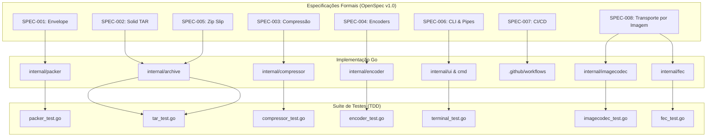

# OpenSpec Manifest & Traceability Matrix 📜

**Projeto:** `pack2txt`  
**Metodologia:** Spec-Driven Development (SDD)  
**Versão do Protocolo:** OpenSpec v1.0.0  
**Status do Ciclo:** 🔒 **MILESTONE v1.0 CONCLUÍDA E SELADA** — 🟡 SPEC-008 (v1.1) em desenvolvimento  
**Guia para Novas Features:** Consulte [`SPEC_LIFECYCLE.md`](SPEC_LIFECYCLE.md)  

---

## 📑 Índice de Especificações (OpenSpec Suite v1.0)

| ID | Título da Especificação | Módulo Correspondente | Testes de Validação | Status |
|---|---|---|---|---|
| **[SPEC-001](file:///home/douglas/Workspace/gemini/pack2txt/openspec/SPEC-001_ENVELOPE_PROTOCOL.md)** | Protocolo de Envelope & Gramática ABNF | `internal/packer/envelope.go` | `internal/packer/packer_test.go` | 🔒 Concluído |
| **[SPEC-002](file:///home/douglas/Workspace/gemini/pack2txt/openspec/SPEC-002_SOLID_TAR_STREAMING.md)** | Solid TAR Streaming em Memória & Filtros | `internal/archive/tar.go` `internal/archive/filter.go` | `internal/archive/tar_test.go` | 🔒 Concluído |
| **[SPEC-003](file:///home/douglas/Workspace/gemini/pack2txt/openspec/SPEC-003_COMPRESSION_ENGINE.md)** | Motor de Compressão Máxima & Auto-Optimizer | `internal/compressor/` | `internal/compressor/compressor_test.go` | 🔒 Concluído |
| **[SPEC-004](file:///home/douglas/Workspace/gemini/pack2txt/openspec/SPEC-004_TEXT_ENCODERS.md)** | Codificadores de Texto de Alta Densidade | `internal/encoder/` | `internal/encoder/encoder_test.go` | 🔒 Concluído |
| **[SPEC-005](file:///home/douglas/Workspace/gemini/pack2txt/openspec/SPEC-005_SECURITY_ZIP_SLIP.md)** | Segurança Rigorosa & Defesa Anti-Zip Slip | `internal/archive/security.go` | `internal/archive/tar_test.go` | 🔒 Concluído |
| **[SPEC-006](file:///home/douglas/Workspace/gemini/pack2txt/openspec/SPEC-006_CLI_PIPES_UX.md)** | Interface CLI, Pipes Unix & Experiência de Terminal | `cmd/pack2txt/main.go` `internal/ui/` | `internal/ui/terminal_test.go` | 🔒 Concluído |
| **[SPEC-007](file:///home/douglas/Workspace/gemini/pack2txt/openspec/SPEC-007_CI_CD_DISTRIBUTION.md)** | CI/CD Multi-Plataforma & Distribuição | `.github/workflows/release.yml` | GitHub Actions CI Runner | 🔒 Concluído |
| **[SPEC-008](file:///home/douglas/Workspace/gemini/pack2txt/openspec/SPEC-008_IMAGE_CODEC.md)** | Transporte por Imagem & Codec de Módulos Tolerante a Perdas | `internal/imagecodec/` `internal/fec/` | `internal/imagecodec/imagecodec_test.go` `internal/fec/fec_test.go` | 🟡 Em Desenvolvimento |

---

## 🎯 Matriz de Rastreabilidade (Traceability Matrix)

---

## 🚀 Como Iniciar uma Nova Feature Futura

Para iniciar qualquer nova funcionalidade a partir desta baseline:
1. Abra um novo ciclo de planejamento com o comando `/plan`.
2. Crie a nova especificação correspondente (`openspec/SPEC-008_...`).
3. Obtenha a aprovação antes da codificação.
4. Desenvolva com TDD garantindo a aprovação de `go test -v -race ./...`.
