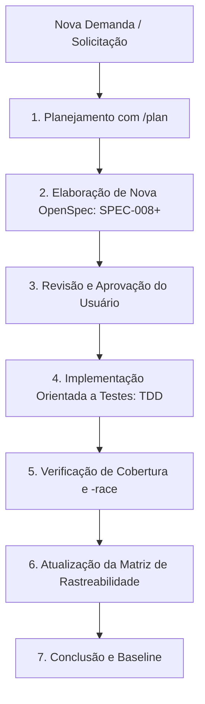

# Ciclo de Vida de Especificações & Novas Funcionalidades (Spec-Driven Development) 🔄

**Projeto:** `pack2txt`  
**Versão Atual:** OpenSpec v1.0.0 (Baseline Concluída)  

---

## 🎯 Protocolo para Criação de Novas Features

Sempre que uma nova funcionalidade, encoder, compressor ou comando for solicitado, o desenvolvimento DEVE seguir o ciclo padronizado do **Spec-Driven Development (SDD)**:

---

## 📋 Passo a Passo para Futuras Features

### Passo 1: Iniciação do Plano (`/plan`)
- Criar um artefato de plano de implementação detalhado com a proposta arquitetural, contratos e plano de verificação.

### Passo 2: Especificação Formal (`openspec/SPEC-XXX_NOME.md`)
- Criar o documento da especificação na pasta `openspec/` seguindo a estrutura padrão:
  - **Document ID:** `SPEC-008`, `SPEC-009`, etc.
  - **Status:** `PROPOSTO` -> `EM DESENVOLVIMENTO` -> `CONCLUÍDO / IMPLEMENTADO`.
  - **Gramática / Estruturas de Dados.**
  - **Critérios de Aceitação em Gherkin (`Given/When/Then`).**

### Passo 3: Aprovação do Usuário
- Obter validação e aprovação do usuário antes de realizar alterações de código.

### Passo 4: Implementação com TDD
- Criar testes unitários correspondentes aos critérios Gherkin antes ou em conjunto com a implementação do código-fonte Go.

### Passo 5: Atualização do Índice
- Atualizar a tabela de rastreabilidade em [`openspec/INDEX.md`](file:///home/douglas/Workspace/gemini/pack2txt/openspec/INDEX.md).

---

## 🔒 Status da Baseline Atual (v1.0.0)

A baseline atual do protocolo **OpenSpec v1.0** está **concluída, selada e 100% verificada**:
- `SPEC-001`: Protocolo de Envelope `PACK2TXT:v1:...` & Autodetecção Fallback.
- `SPEC-002`: Solid TAR Streaming em Memória & Filtros de Dev.
- `SPEC-003`: Motor de Compressão (Brotli Q11, Zstandard, Gzip, None e Auto).
- `SPEC-004`: Codificadores Textuais (Base32768, Base91, Base85, Base64).
- `SPEC-005`: Segurança Rigorosa & Defesa Anti-Zip Slip.
- `SPEC-006`: Interface CLI, Pipes Unix & Terminal UX.
- `SPEC-007`: CI/CD Multi-Plataforma & Distribuição.
